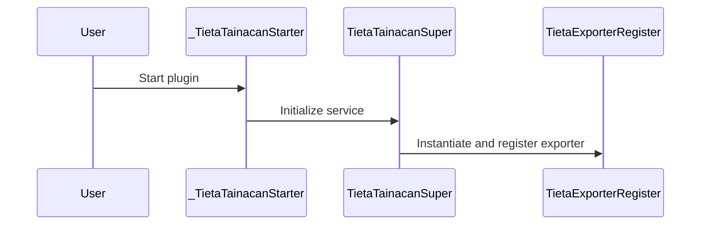
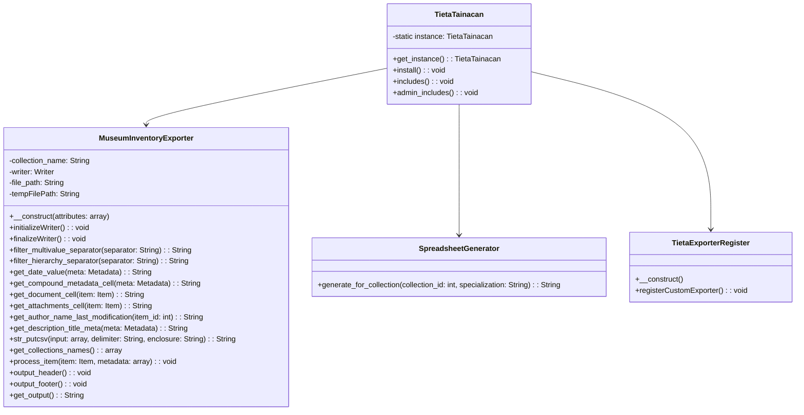
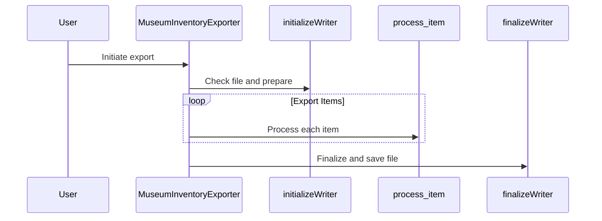

# Tieta - Tainacan INBCM Exporter Tool Application

The Museum Inventory Exporter plugin extends the Tainacan project by providing a custom exporter designed specifically for museum inventories. It allows administrators to export items from a single collection into a CSV file format, facilitating inventory management and archival processes, folloing the Brazilian IBRAM formats.

## Disclaimer

This plugin is specifically designed for use by Brazilian institutions and individuals who need to export data to meet the inventory requirements of the Brazilian Institute of Museums (Instituto Brasileiro de Museus - IBRAM). While the plugin may be useful in other contexts, its features and export formats are tailored to comply with IBRAM's guidelines and standards.

Please note that this plugin is still in beta. While we strive to ensure accuracy and compliance with IBRAM requirements, users should verify the exported data's conformity with current IBRAM standards before official submission. The developers of this plugin assume no responsibility for any discrepancies or non-compliance issues that may arise from the use of this tool in your inventory management processes.

Usage of this plugin outside of Brazil or for purposes other than exporting data for IBRAM inventory requirements is possible but not officially supported. Users are encouraged to review the plugin's documentation and source code to assess its suitability for other applications.

We welcome feedback and contributions from the community to improve the plugin and expand its capabilities. Please refer to the [Contributing](#contributing) section for more information on how you can help.

## Features

- **Custom CSV Export**: Export taxonomy terms and custom fields relevant to museum inventory management.
- **Flexible Export Options**: Choose to export items from a single collection or aggregate data from multiple collections.
- **User-friendly Interface**: Integrates seamlessly with the Tainacan interface, providing an intuitive user experience.

## Installation

1. **Download the Plugin**: Download the zip file from the repository or clone it directly into your WordPress plugins directory.
2. **Extract the Plugin**: If you downloaded the zip file, extract it in the `/wp-content/plugins/` directory of your WordPress installation.
3. **Activate the Plugin**: Log into your WordPress dashboard, navigate to the Plugins menu, and activate the "Museum Inventory Exporter for Tainacan" plugin.

## Usage

Once the plugin is activated, it integrates directly into the Tainacan export functionality. To use the custom exporter:

1. Navigate to the Tainacan dashboard within your WordPress admin panel.
2. Select the collection or collections you wish to export.
3. Choose "XLSX for the National Inventory of Museum Cultural Assets (INBCM)" from the list of available export options.
4. Configure any specific export settings as required.
5. Initiate the export process.

## Configuration

This plugin requires no additional configuration outside the standard Tainacan setup. However, ensure that Tainacan is installed and activated before activating this plugin.

## Contributing

Contributions are welcome. Please fork the repository and submit pull requests with your proposed changes. For major changes, please open an issue first to discuss what you would like to change.

## License

This plugin is licensed under the [GPLv2 (or later)](https://www.gnu.org/licenses/old-licenses/gpl-2.0.html) license.

## Acknowledgements

- This plugin was developed for the Tainacan project. More information about Tainacan can be found at [their official website](https://tainacan.org/).
- Special thanks to the Tainacan community and all contributors to this plugin.

## Support

For support with this plugin, please [open an issue](link-to-your-repo/issues) in the GitHub repository. For general Tainacan support, refer to the [Tainacan documentation](https://tainacan.org/documentacao/).

### Por trás do código 

### Diagrama de Classes

1. **Classe `TietaTainacan`:**
   - Métodos:
     - `get_instance()`: Retorna a instância Singleton da classe.
     - `install()`: Verifica se o plugin Tainacan está ativo antes da ativação do plugin Tieta.
     - `includes()`: Inclui arquivos necessários para a execução do plugin.
     - `admin_includes()`: Inclui arquivos específicos do painel administrativo.

2. **Classe `MuseumInventoryExporter` (herda de `Tainacan\Exporter\Exporter`):**
   - Atributos:
     - `$collection_name`: Nome da coleção.
     - `$writer`: Instância do escritor para a exportação de arquivos.
     - `$file_path`: Caminho para o arquivo de exportação.
     - `$tempFilePath`: Caminho temporário para a manipulação de arquivos.
   - Métodos:
     - `__construct()`: Construtor da classe, define o nome do arquivo e outras configurações.
     - `initializeWriter()`: Inicializa o escritor para manipular o arquivo de exportação.
     - `finalizeWriter()`: Finaliza e salva o arquivo de exportação.

3. **Classe `SpreadsheetGenerator`:**
   - Métodos:
     - `generate_for_collection($collection_id, $specialization)`: Gera uma planilha para a coleção especificada.

4. **Classe `TietaExporterRegister`:**
   - Métodos:
     - `__construct()`: Adiciona ação para registrar o exportador personalizado.
     - `registerCustomExporter()`: Registra o exportador personalizado no manipulador de exportação do Tainacan.

### Diagrama de Sequência

- **Inicialização do Plugin:**
  - O processo começa com a função `_TietaTainacanStarter`, que inicializa o plugin e carrega os textos.
  - Em seguida, a função `TietaTainacanSuper` é chamada para criar a instância do plugin e configurar os ganchos necessários.
  - O método `install` é chamado para verificar as dependências do plugin.
  - `includes` e `admin_includes` são chamados para incluir arquivos necessários e configurar o ambiente administrativo, respectivamente.

- **Processo de Exportação:**
  - Inicia-se com a criação de um objeto `MuseumInventoryExporter`.
  - `initializeWriter` é chamado para preparar o arquivo de exportação, copiando conteúdo de um arquivo existente se necessário.
  - Durante a exportação, `process_item` é chamado para processar e adicionar cada item ao arquivo.
  - `finalizeWriter` é chamado no final para fechar e salvar o arquivo de exportação.